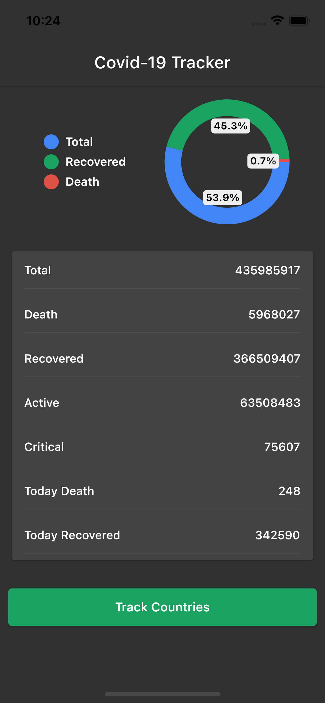
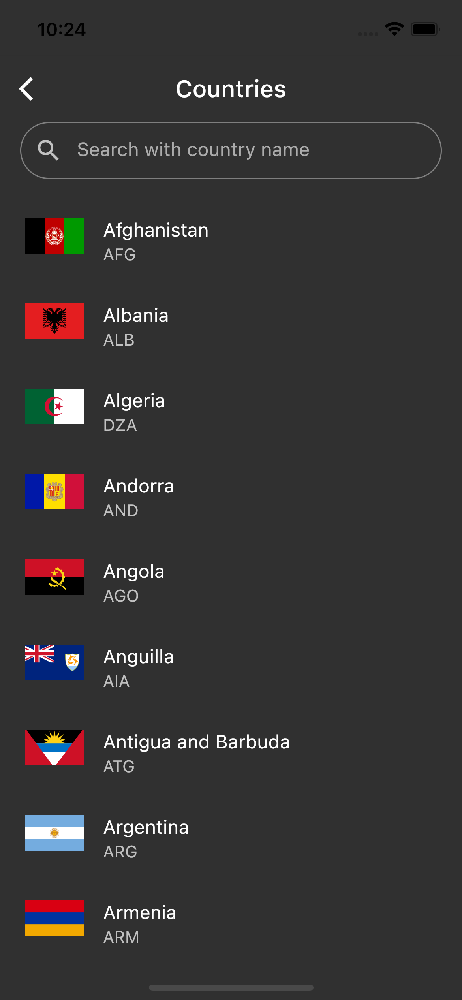

## Covid-19 Tracker App using Flutter

  A simple and clean Covid-19 Tracker App, works in both andoid and iOS.

## Features

- Animated Splash screen.
- Diagramtic representaions using Pi-chart.
- Representaion of World Covid details in a nutshell.
- Real-time data from APIs.
- Shimmer animation effect.
- Search countries.
- Track covid details of each country in deatial.

## Tech Used

Client side : Flutter

APIs : 'https://disease.sh/v3/covid-19/all' and 'https://disease.sh/v3/covid-19/countries'

## Screenshots

  
  
</div
